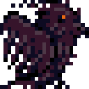

    

    

## crackerer
### What is it?
Crackerer is simple bruteforce-based application written in node.js that allows you to check for unique steam names.
### How to use it?
It's very simple. All you need to do is install `steam-web` package from node package manager by typing `npm i steam-web --save` in your terminal, request for steam web api key [here](https://steamcommunity.com/dev) and paste it into your `config.json`. After doing that, you should launch the app (`node app.js`). Bruteforce dictionary format is words separated by new line.
##### Note (!)
If you dont have basic knowledge about programming, navigate to RELEASES tab on repository page and download the latest **crackerer** version 🐢

### Commands documentation

| command  | argument         | explaination                                 |
|----------|------------------|----------------------------------------------|
| interval | int              | Time, that app will wait before each check.  |
| path     | string           | Path to our bruteforce dictionary.           |
| check    | string           | Checks single URL specified in argument.     |
| save     | -                | Saves output to the text file.               |
| author   | -                | Prints info about author to console.         |
| clear    | -                | Clears the console.                          |
| start    | -                | Starts the bruteforce.                       |
| exit     | -                | Terminates process.                          |
| help     | -                | Prints all commands with explainations.      |
